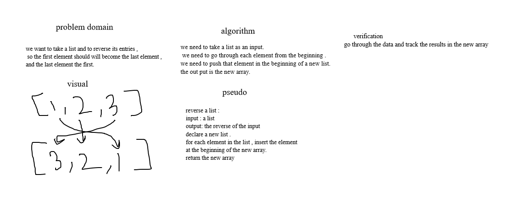

# Reverse an Array
this chellange is about to take a list input and return its revers.

## Whiteboard Process

## Approach & Efficiency
I took the insert method approach , and the bigO time and space = O(n).
