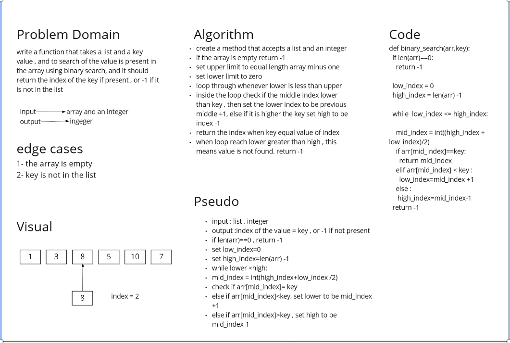

# Binary Search
this challenge is to write a witeboard of binary search code.
##whiteBoard

## Approach & Efficiency
at first i wanted to try to cut the array and creat a new one with every iteration , then i made some research and found the common and more efficient way to handle the binary search
is with having to set a new upper and lower limit every time , insted of assigning a new array everytime.
