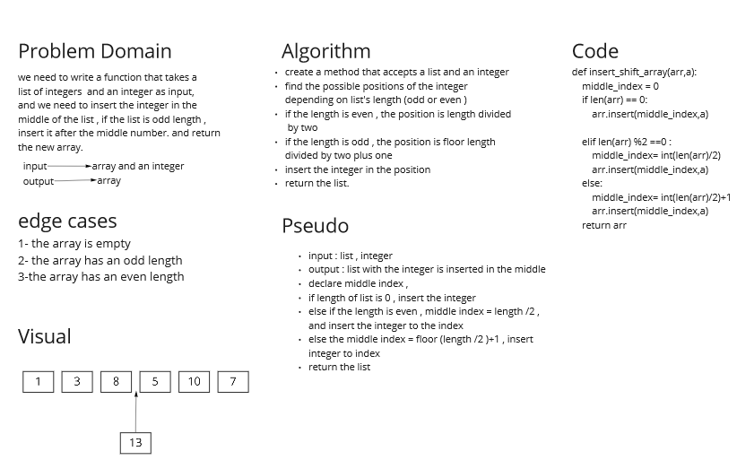

# Insert to Middle of an Array
the challenge wants us to insert an integer to the middle of an array

## Whiteboard Process

## Approach & Efficiency
I went with the insert method , and i faced the problem of the index should be integer not float , thats why i used int to convert and use the integer as indedx, it should be easier and more efficient to handle the challenge.
