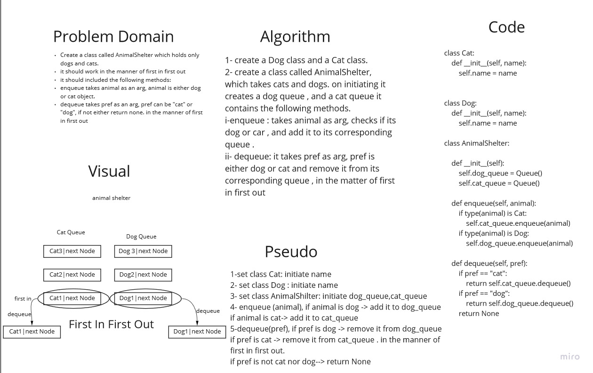

# Animal Shelter
## Challenge Summary
we need to check animals in an animal shelter class. the animals should be either dog or cat . the shelter works on the manner of First in First out .

## Whiteboard Process

## Approach & Efficiency
we utilized the queue class we used before . we set dog class , and cat class. we added animal to cat_queue or dog_queue depending on its type . 

animal shilter class should contain :

1. enqueue:add new animal to its corresponding queue.
2. dequeue: removes animal from its corresponding queue.

## Solution

`class Cat:
    def __init__(self, name):
        self.name = name

class Dog:
    def __init__(self, name):
        self.name = name

class AnimalShelter:

    def __init__(self):
        self.dog_queue = Queue()
        self.cat_queue = Queue()

    def enqueue(self, animal):
        if type(animal) is Cat:
            self.cat_queue.enqueue(animal)
        if type(animal) is Dog:
            self.dog_queue.enqueue(animal)

    def dequeue(self, pref):
        if pref == "cat":
            return self.cat_queue.dequeue()
        if pref == "dog":
            return self.dog_queue.dequeue()
        return None
       
        

