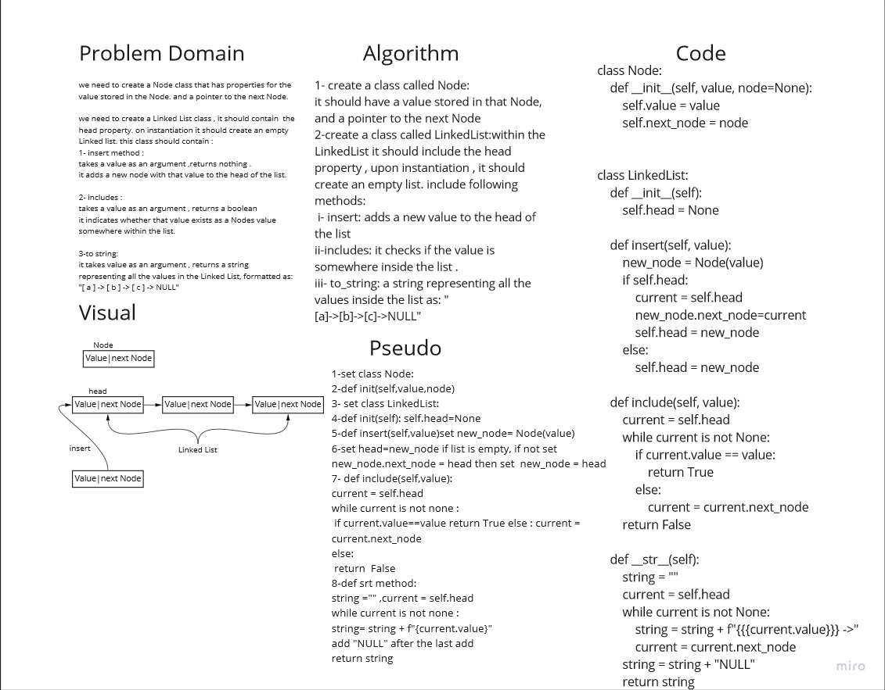
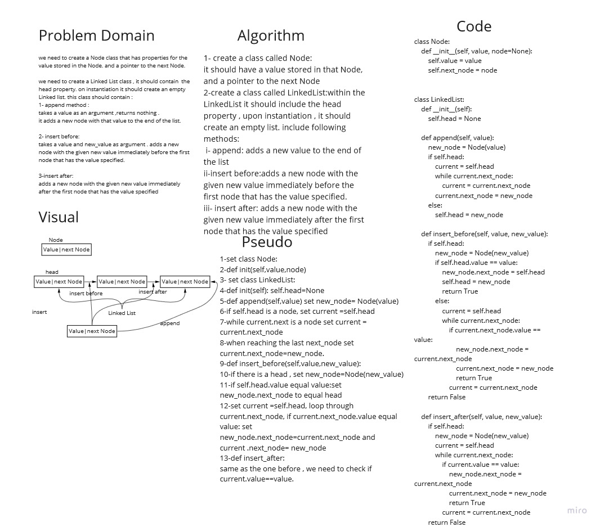
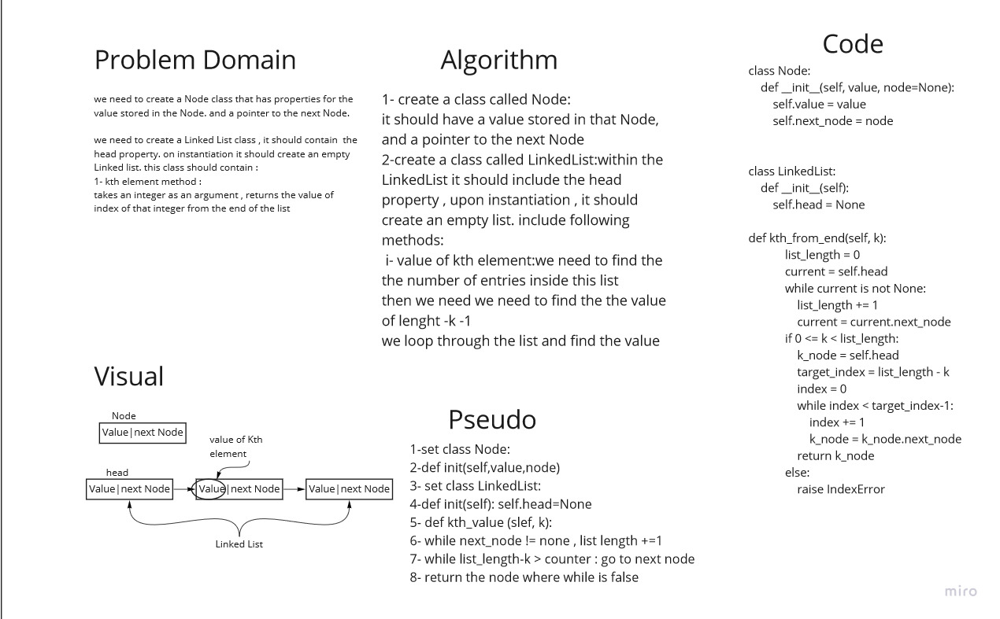

# LinkedList Challenge
in these challenges we will work on linkedlists :
1- insert mothod: to add a node to the head of the list
2-include method: will check if a value presented in a list
3- to string method: to return a string representation of the list. 
4-append method: to add a node to the end of the list
5- insert before: to add a node before a given value
6- insert after method: to add a node after a given value
7-kth element: will return the value of the kth element from the end.

## Whiteboard Process

## Approach & Efficiency
we used the linked list data structure methods, Node and LinkeList as classes and added functions to handle every requirment

