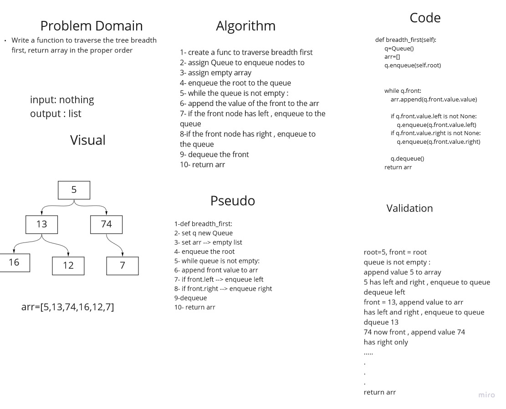

# breadth first  
Write a function to traverse the tree breadth first, return array in the proper order1. assign a max var , set it equal to the value of the root
1. create a func to traverse breadth first
2. assign Queue to enqueue nodes to
3. assign empty array
4. enqueue the root to the queue
5. while the queue is not empty :
6. append the value of the front to the arr
7. if the front node has left , enqueue to the queue
8. if the front node has right , enqueue to the queue
9. dequeue the front
10. return arr

## Whiteboard Process

## Approach & Efficiency
we created the function, we assign new queue, set empty arr, we looped through the tree ,appending the value of the front of the queue to the arr,  enqueueing the left and right node to the queue,and dequeueing from the queue.