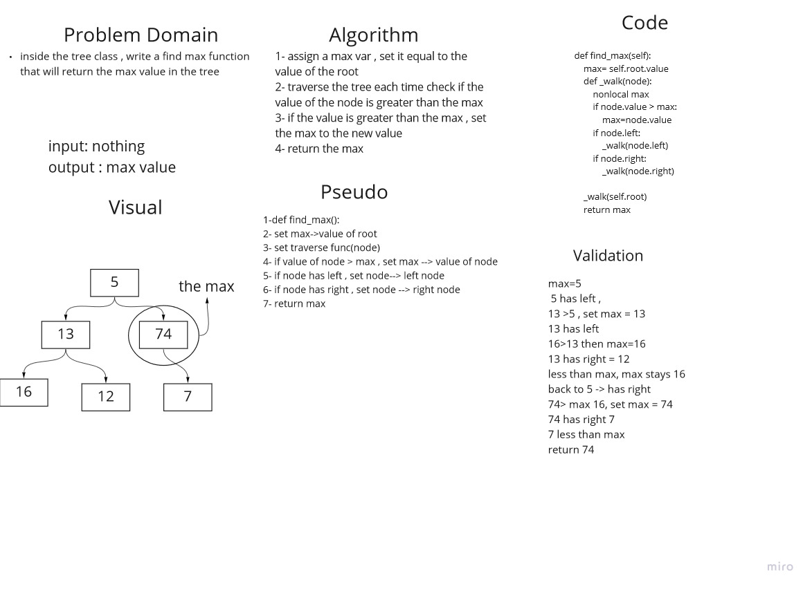

# Binary Tree and BST Implementation 
we need to create a function to find the max value in a tree:
1. assign a max var , set it equal to the value of the root
2. traverse the tree each time check if the value of the node is greater than the max
3. if the value is greater than the max , set the max to the new value
4. return the max

## Whiteboard Process

## Approach & Efficiency
we created the function, we assigned a max var = root.value , then we traversed through the tree compearing every node.value with the max, if the value>max, set max to the new value .
