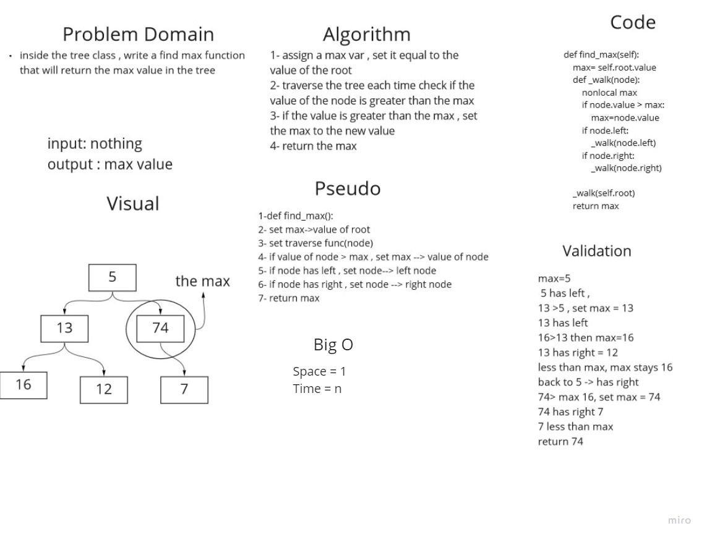

# find max 
we need to create a function to find the max value in a tree:
1. assign a max var , set it equal to the value of the root
2. traverse the tree each time check if the value of the node is greater than the max
3. if the value is greater than the max , set the max to the new value
4. return the max

## Whiteboard Process

## Approach & Efficiency
we created the function, we assigned a max var = root.value , then we traversed through the tree compearing every node.value with the max, if the value>max, set max to the new value .

## Solution
we created a function tthat acceptece a node as an arguemtn , in side the fucntion we assighen a variable max to be equal to the value of the root, the function has inner iterator that will traverce throgh the nodes inside the tree and check each time if the value of a node is greater than the max, and it will reassign the max to be equal to that value . and will return the max value 

## BigO
Time = n
space = 1