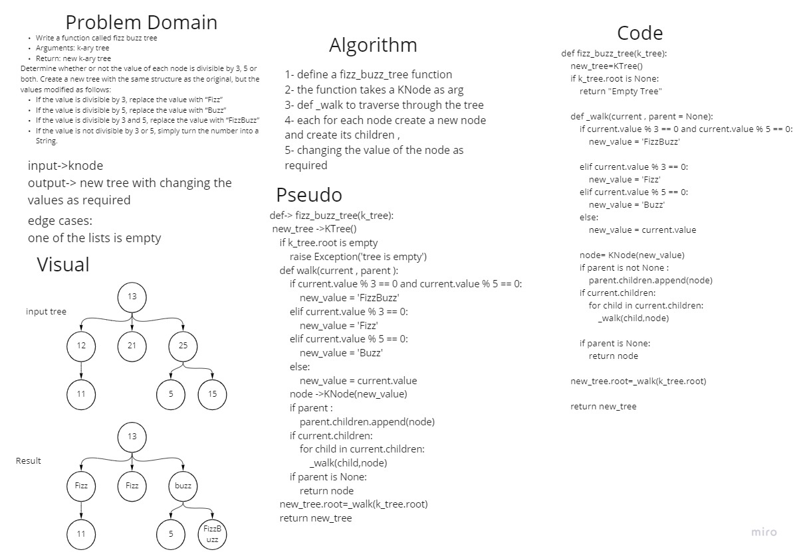

# Fizz-Buzz-Tree
1. we created a new class we called it KNode and it takes value and children nodes as a list 
2. we creatde Ktree class witht he following fucntions:
    - breadth: a function that will travare through the ktree using a queue , where we will keep dequeueing the queue and appending the value of the front to a list, while enqueueing the children of it the the queue 
    - adding_child: this function takes a value and the parent . it will add a node as a child to the parent entered
    - fizz_buzz_tree: takes a ktree node as an arg . it will traverse the tree using a recurssion walk , creating a new tree and adding nodes eachtime , changing the node to fizz, buzz , or fizz-buzz for each node as required . 

## Whiteboard Process

## Approach & Efficiency
we used the recurrsion to walk the tree, and check the values , and changing the values as required.

## bigO
O time = n

O space = 1