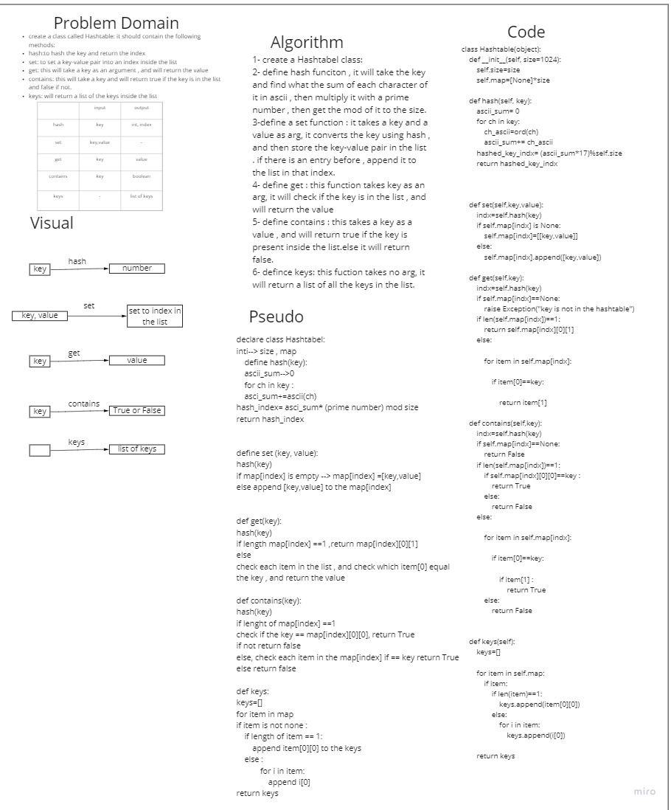

# hashtables
we need to implement the Hashtable class, it contains the following fuicntions :
1. on initiation it should get size as argument , and it will construct a list with lenght of the size and filled with None in every entry in the list .
2. hash: this function will take a key as an arguemnt, it will convert the key using ascii codes then multipliate it with a prime number then get the mode of it to the size , this number will be the index of the key-value pair in the list.

3. set:takes a key and value as argument, will assign the key-value pair to the index of inside the hashtable list

4. get: this takes key as an argument, and will return the value of it in the hashtable list

5. contains: takes key as an argument ,and will return True if the key is presented in the list , and False if not.

6. keys: this will return a list of all the keys in the list.

## Whiteboard Process

## Approach & Efficiency
we created several fucniton to server the purpose of this challenge , each fucntion were created seperatly inside the class as required.

## BigO: 
time: n
space:1

## pull request
[pull request](https://github.com/SalimHass/data-structures-and-algorithms/pull/23)
