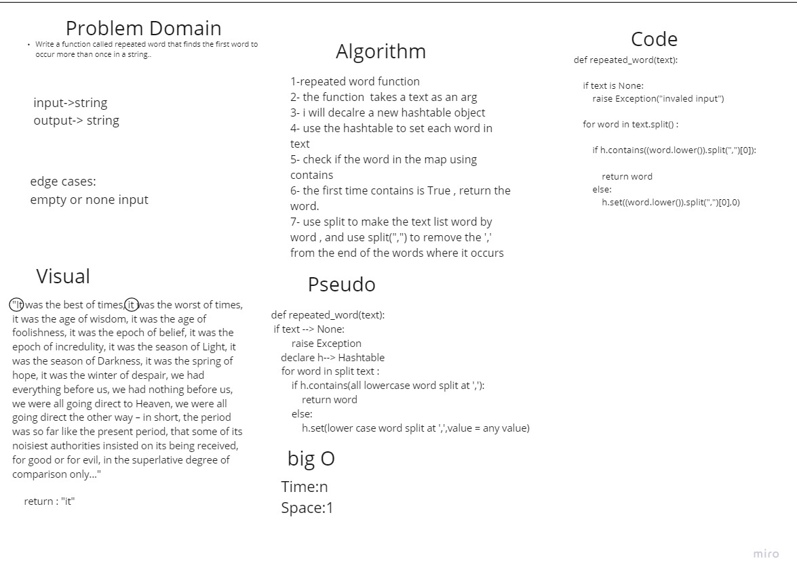

# reapeated word
in this challenge we should Write a function called repeated word that finds the first word to occur more than once in a string


## Whiteboard Process



## Approach & Efficiency
i used the hashtable class to utilize this challenge , i created a new hashtable object , and used it to set every word in the text input inside this hashtable, then the code will check if this word already exist inside the hastable map , the function will return the word
## BigO: 
time: n
space:1

## solution
```
def repeated_word(text):
    h=Hashtable()
    if text is None:
        raise Exception("invaled input")

    for word in text.split() :
        
        if h.contains((word.lower()).split(",")[0]):

            return word
        else: 
            h.set((word.lower()).split(",")[0],0)
```

## pull request
[pull request1](https://github.com/SalimHass/data-structures-and-algorithms/pull/25)
[pull request2](https://github.com/SalimHass/data-structures-and-algorithms/pull/26)

