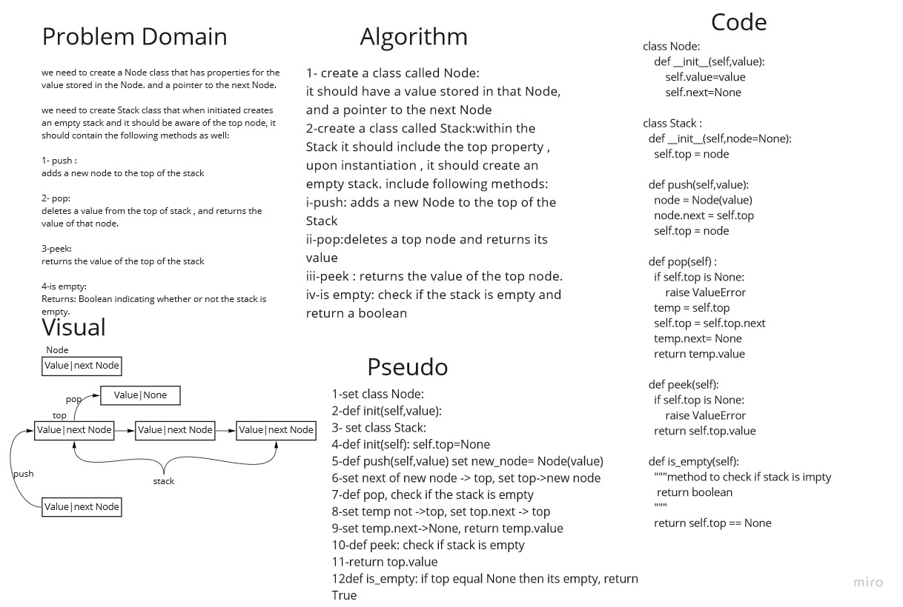
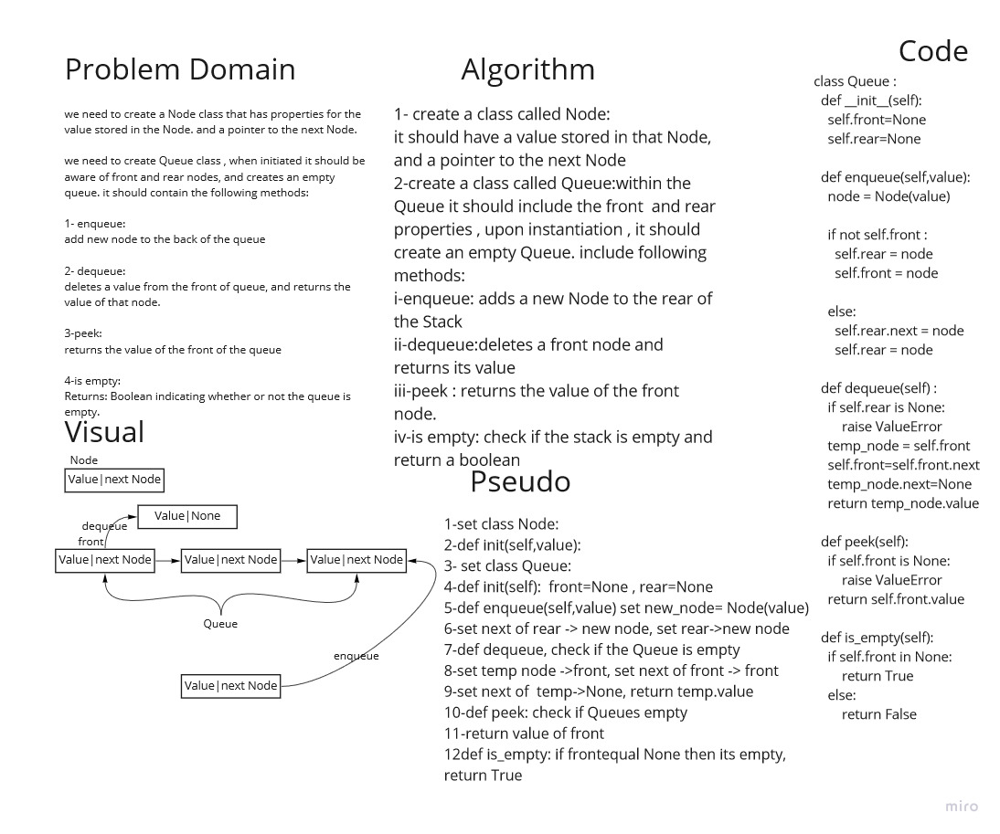

# LinkedList Challenge
in these challenges we will work on stack and queues :
### Stack 
1. push mothod: to add a node to the top of the stack
2. pop method: to delete top node and returns its value
3. peek: to return the value of the top node. 
4. is empty method: returns boolean to check if the stack is empty
### Queue
 5. enqueue:add new node to the back of the queue
6. dequeue: deletes a value from the front of queue, and returns the value of that node.
7. peel: returns the value of the front of the queue.
8. is empty: Returns: Boolean indicating whether or not the queue is empty.

## Whiteboard Process

## Approach & Efficiency
we used the stack and queue data structure methods, Node,stack and queue as classes and added functions to handle every requirment