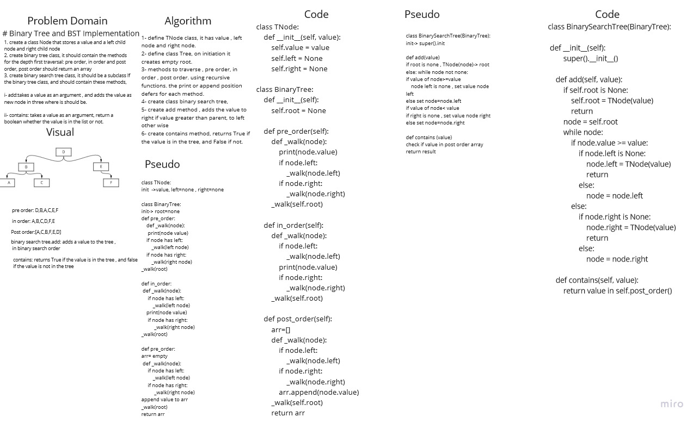

# Binary Tree and BST Implementation 

1. create a class Node that stores a value and a left child node and right child node
2. create binary tree class, it should contain the methods for the depth first traversal: pre order, in order and post order, post order should return an array
3. create binary search tree class, it should be a subclass lf the binary tree class, and should contain these methods, 

        i- add:takes a value as an argument , and adds the value as new node in three where is should be.

        ii- contains: takes a value as an argument, return a boolean whether the value is in the list or not. 

## Whiteboard Process

## Approach & Efficiency

we used tree node that contains value and left and right pointers, then we created a tree , the traversing methods used as required by definition 
