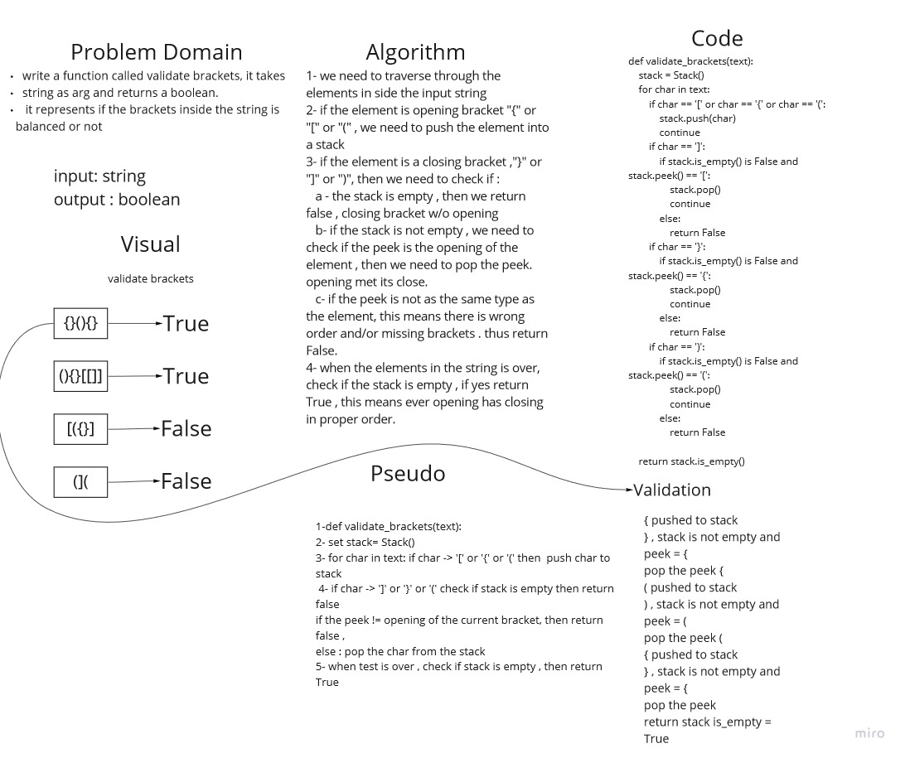

# Validate brackets

write a function that takes string as arg , and check if the brackets in side the string is balanced or not, return a boolean of the state

## Whiteboard Process

## Approach & Efficiency
we utilized the stack , to push and pop elements from the input sring.