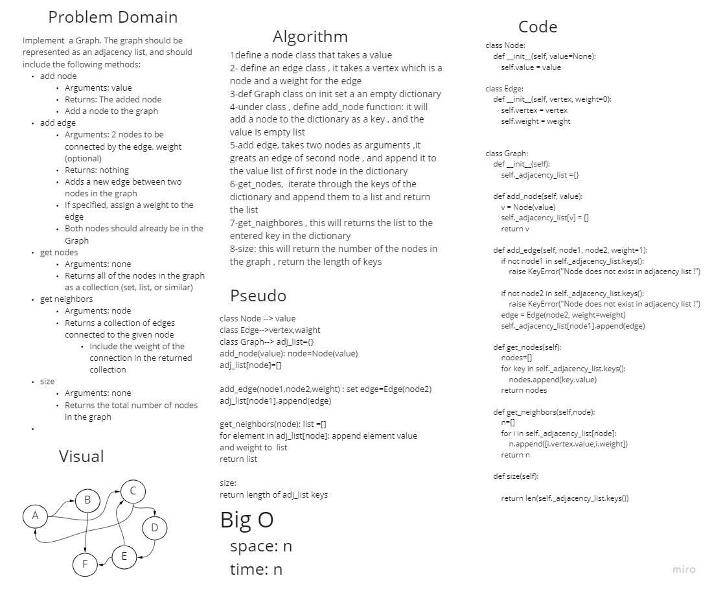

# Graphs 
in this challenge we should implenet graphs and understand the data structure and algorathem of graphs and its methods


## Whiteboard Process



## Approach & Efficiency
in this challenge we created a graph by assigning a node and egdes as classes , then in the graph class we added "add_node" and "add_edge" as functions to add the node and its edges to the graph , and we added "size" function to get the size of the graph , "get_nodes" to get the nodes of the graph , and "get_naighbors" to get the naighbores of a node.
## BigO: 
time: n
space:n

## solution
```
class Node:
    def __init__(self, value=None):
        self.value = value
    
    def __str__(self):
        return self.value


class Edge:
    def __init__(self, vertex, weight=0):
        self.vertex = vertex
        self.weight = weight


class Graph:
    def __init__(self):
        self._adjacency_list ={}

    def add_node(self, value):
        v = Node(value)
        self._adjacency_list[v] = [] #A LinkedList
        return v

    def add_edge(self, node1, node2, weight=1):
        if not node1 in self._adjacency_list.keys():
            raise KeyError("Node does not exist in adjacency list !")

        if not node2 in self._adjacency_list.keys():
            raise KeyError("Node does not exist in adjacency list !")
        
        edge = Edge(node2, weight=weight)
        self._adjacency_list[node1].append(edge)

    def get_nodes(self):
        nodes=[]
        for key in self._adjacency_list.keys():
            
            nodes.append(key.value)

       
            
        return nodes

    def get_neighbors(self,node):
        n=[]
        for i in self._adjacency_list[node]:
            
            n.append([i.vertex.value,i.weight])
        return n

    def size(self):

                    
        return len(self._adjacency_list.keys())

    def __str__(self):
        output = ''

        for vertex in self._adjacency_list.keys():
            output+= f'{vertex} ->'
            for edge in self._adjacency_list[vertex]:
                output += f'{edge.vertex}-->'
            output+='\n'
        
        return output
```

## pull request
[pull request]()

