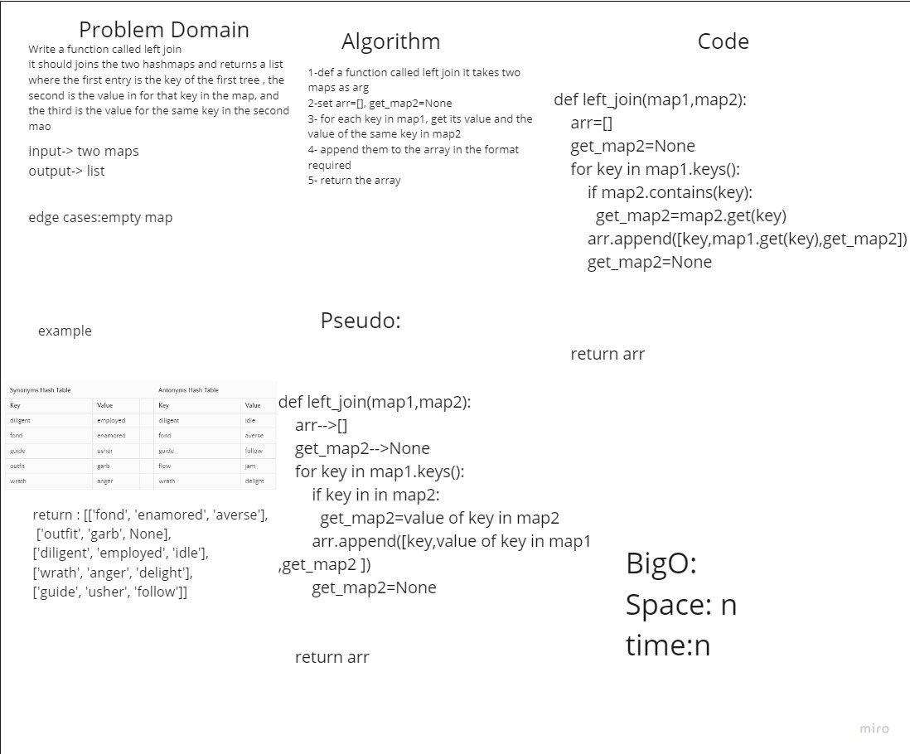

# hashmap_left_join
in this challenge we should join two maps in the form of list of list , each list consists of [key , value, value for the same key in the 2nd map]


## Whiteboard Process



## Approach & Efficiency
in this challenege i used for loop to iterate through the key list , then i used the get method to gey the values for both the first map and the second , if the key is not in the second map use None insted .

## BigO: 
time: n
space:n

## solution
```

def left_join(map1,map2):
    arr=[]
    get_map2=None
    for key in map1.keys():
        if map2.contains(key):
          get_map2=map2.get(key)  
        arr.append([key,map1.get(key),get_map2])
        get_map2=None


    return arr
```

## pull request
[pull request]([https://github.com/SalimHass/data-structures-and-algorithms/pull/27](https://github.com/SalimHass/data-structures-and-algorithms/pull/29))

