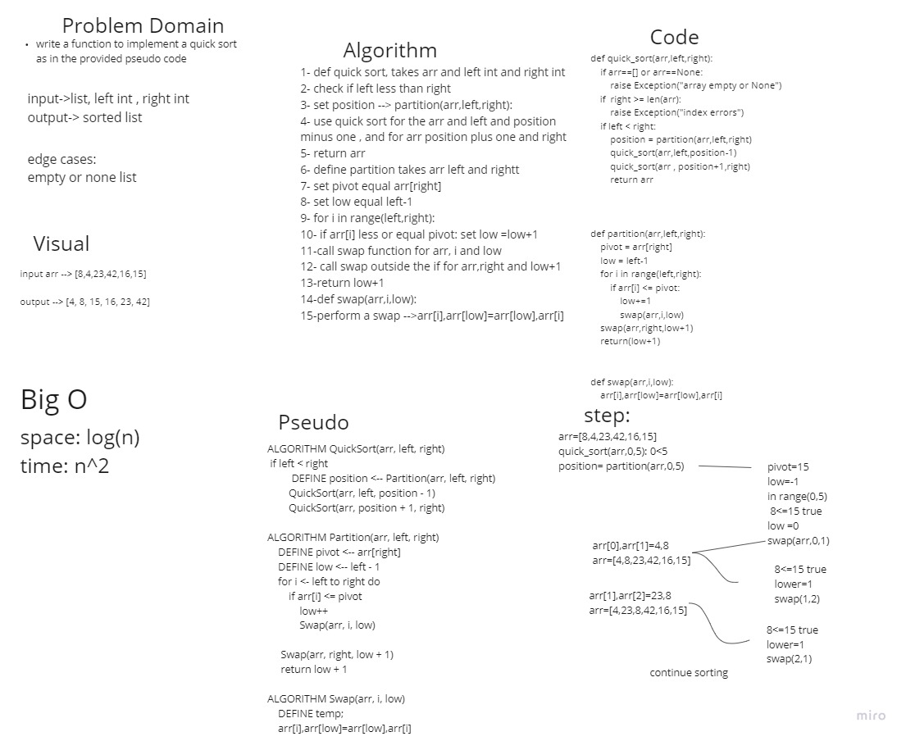

# Quick Sort
# Challenge Summary
quick sort is a Divide and Conquer algorithm. It picks an element as pivot and partitions the given array around the picked pivot. There are many different versions of quickSort that pick pivot in different ways. 
## Whiteboard Process



## Approach & Efficiency
### 
we used quick sort to sort an array. 

quick sort works in the manner of picking a random entry inside the array , its called pivot, and start compairing elements to that pivot and replace the elements in respect of that pivot .

### Efficency
Time: O(nlog(n))
Space: O(1)


## Solution
```

def quick_sort(arr,left,right):
    if arr==[] or arr==None:
        raise Exception("array empty or None")
    if  right >= len(arr):
        raise Exception("index errors")
    if left < right:
        position = partition(arr,left,right)
        quick_sort(arr,left,position-1)
        quick_sort(arr , position+1,right)
        return arr


def partition(arr,left,right):
    pivot = arr[right]
    low = left-1
    for i in range(left,right):
        if arr[i] <= pivot:
            low+=1
            swap(arr,i,low)
    swap(arr,right,low+1)
    return(low+1)


def swap(arr,i,low):
    arr[i],arr[low]=arr[low],arr[i]


```
## Pull request
[pull request](https://github.com/SalimHass/blogs/pull/2/)

## Blog
[blog](../quick/README.md)