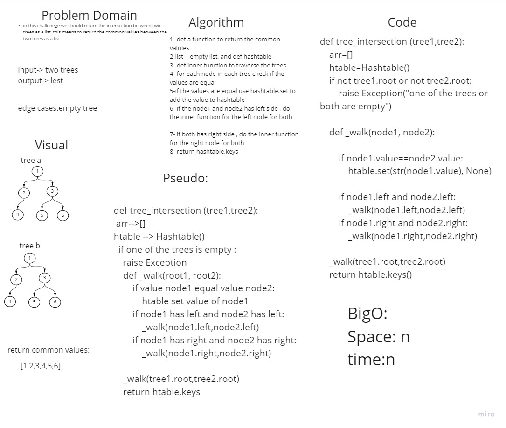

# intersection Tree 
in this challenege we should return the intersection between two trees as a list, this means to return the common values between the two trees as a list


## Whiteboard Process



## Approach & Efficiency
in this challenge i used a recursive function to traverce through the tree , and for each node check if the nodes values are equal if the nodes values are equal i used hashtable and set the value to the table , finally i will return the keys of this table
## BigO: 
time: n
space:n

## solution
```
def tree_intersection (tree1,tree2):
    arr=[]
    htable=Hashtable()
    if not tree1.root or not tree2.root:
        raise Exception("one of the trees or both are empty")
    
    def _walk(node1, node2):
        
        if node1.value==node2.value:
            htable.set(str(node1.value), None)
        
        if node1.left and node2.left:
            _walk(node1.left,node2.left)
        if node1.right and node2.right:
            _walk(node1.right,node2.right)
    
    _walk(tree1.root,tree2.root)
    return htable.keys()
```

## pull request
[pull request1](https://github.com/SalimHass/data-structures-and-algorithms/pull/27)
[pull request2](https://github.com/SalimHass/data-structures-and-algorithms/pull/28)

